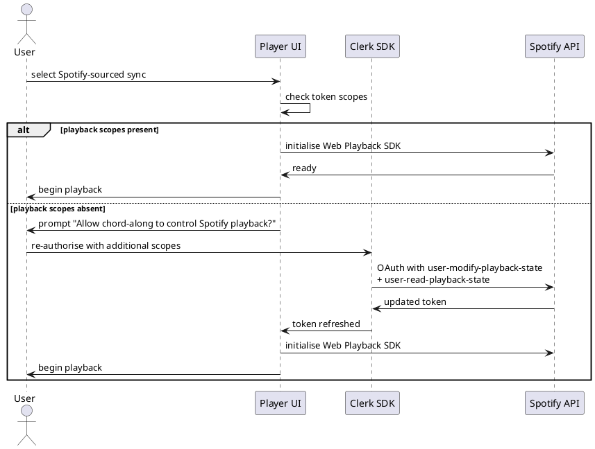

## ADDED Requirements

### Requirement: Managed authentication via Clerk

The system SHALL use Clerk as the managed authentication service. Clerk handles
the OAuth dance, session management, JWT issuance, and provider configuration.
The Quarkus backend SHALL validate Clerk-issued JWTs via OIDC (Clerk's JWKS
endpoint) without knowing which provider issued the underlying identity.

#### Scenario: Backend validates JWT without provider awareness

- **WHEN** the frontend sends a Bearer JWT on an authenticated API request
- **THEN** the Quarkus backend SHALL validate the JWT signature against Clerk's JWKS endpoint and extract the `sub` claim as the Clerk user id

#### Scenario: Adding a provider requires no code change

- **WHEN** a new OAuth provider is enabled in the Clerk dashboard
- **THEN** the system SHALL support it without any changes to backend validation logic

### Requirement: Supported login providers

The system SHALL support Google and Spotify as OAuth login providers in the MVP.
No other providers SHALL be configured in the initial release.

#### Scenario: User logs in with Google

- **WHEN** a user clicks "Login with Google"
- **THEN** Clerk SHALL redirect through the Google OAuth flow and return a session on success

#### Scenario: User logs in with Spotify

- **WHEN** a user clicks "Login with Spotify"
- **THEN** Clerk SHALL redirect through the Spotify OAuth flow requesting identity scopes only (`user-read-private user-read-email`) and return a session on success

### Requirement: Identity-only scopes at login

At login time the system SHALL request only identity scopes from the OAuth
provider. For Spotify, this means `user-read-private` and `user-read-email`.
Playback scopes SHALL NOT be requested at login.

#### Scenario: Spotify login does not request playback permission

- **WHEN** a user logs in with Spotify
- **THEN** the Spotify permission screen shown to the user SHALL NOT include `user-modify-playback-state` or `user-read-playback-state`

### Requirement: Incremental Spotify playback scopes

When a user who is authenticated via Spotify attempts to play a Spotify-sourced
sync, the system SHALL detect whether the Spotify access token includes playback
scopes. If not, the system SHALL prompt the user to grant the additional
permission before initiating playback.



#### Scenario: Spotify playback prompt shown once

- **WHEN** a Spotify-authenticated user selects a Spotify-sourced sync for the first time
- **AND** the current token does not include `user-modify-playback-state`
- **THEN** the player SHALL display a prompt and trigger Clerk's incremental scope re-authorisation flow

#### Scenario: No prompt for subsequent plays

- **WHEN** a user has already granted playback scopes in this session
- **THEN** the player SHALL proceed directly to playback without prompting

#### Scenario: Prompt is not shown for YouTube-sourced syncs

- **WHEN** a user selects a YouTube-sourced sync
- **THEN** no Spotify permission prompt SHALL be shown, regardless of auth provider

### Requirement: User entity provisioned on first login

When a user authenticates for the first time, the system SHALL create a `User`
row and a corresponding `UserIdentity` row if none exists for that provider +
providerUserId pair.

```
User {
  id:          UUID       — internal; referenced by all other entities
  displayName: String     — from provider profile
  avatarUrl:   String?    — from provider profile
  email:       String?    — provider may withhold this
  createdAt:   Instant
}

UserIdentity {
  userId:         UUID    → User.id
  provider:       "google" | "spotify"
  providerUserId: String  — stable id from the provider
  accessToken:    String? — stored only when playback scopes are held
  refreshToken:   String?
}
```

#### Scenario: New user gets a User row on first login

- **WHEN** a user completes the OAuth flow for the first time
- **THEN** the system SHALL create a `User` row and a `UserIdentity` row for that provider

#### Scenario: Returning user reuses existing row

- **WHEN** a user who has previously logged in completes the OAuth flow again
- **THEN** the system SHALL not create a new `User` row; the existing row SHALL be used

#### Scenario: User display name comes from provider profile

- **WHEN** a `User` row is created
- **THEN** `displayName` SHALL be populated from the provider's profile name field

### Requirement: Account deletion anonymises content

When a user deletes their account, the system SHALL:
1. Reassign all `Transcription.authorId` and `Sync.authorId` to the sentinel user (`id = '00000000-0000-0000-0000-000000000000'`).
2. Hard-delete all `Like` rows for that user.
3. Delete the `User` and all `UserIdentity` rows.
4. Revoke the user's Clerk identity.

Content (transcriptions and syncs) SHALL remain accessible after deletion.

#### Scenario: Account deletion completes atomically

- **WHEN** a user confirms account deletion
- **THEN** the reassignment, like deletion, User row deletion, and Clerk revocation SHALL all succeed or all roll back

#### Scenario: Orphaned content is attributed to sentinel

- **WHEN** content previously authored by a deleted user is displayed
- **THEN** the author SHALL be shown as "Deleted User" with no profile link

#### Scenario: Deleted user cannot log back in

- **WHEN** someone attempts to log in using the credentials of a deleted account
- **THEN** Clerk SHALL not recognise the identity and the login SHALL fail
