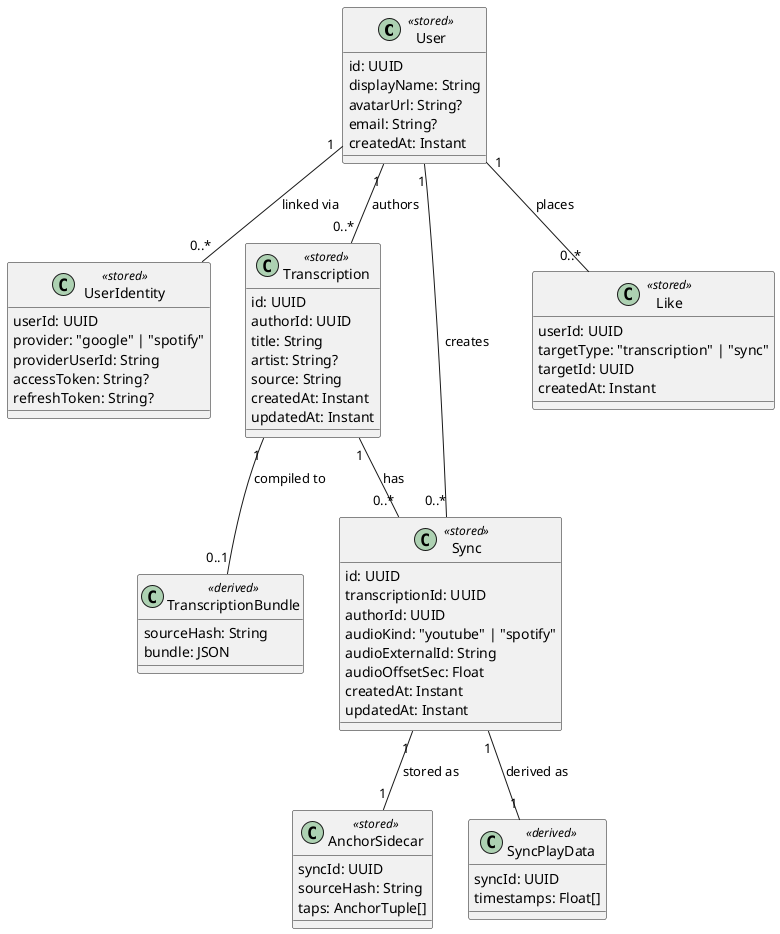

## ADDED Requirements

### Requirement: Domain entity model

The system SHALL persist the following entities. Entities marked `<<stored>>` are
rows in the relational database. Entities marked `<<derived>>` are computed on
demand from stored data and cached by `sourceHash`; they are never the source of
truth.

`Transcription.source` is the raw ChordPro text. `TranscriptionBundle` is
derived by compiling that text; the result is cached keyed on `sourceHash`
(SHA-256 of the UTF-8 source, hex-encoded, lower-case). `AnchorSidecar.taps`
holds the rich anchor tuples recorded during a tap session.
`SyncPlayData.timestamps` is derived from the anchor tuples and the
TranscriptionBundle at serve time.

#### Scenario: Transcription author is tracked

- **WHEN** a logged-in user creates a transcription
- **THEN** `Transcription.authorId` SHALL be set to that user's `User.id`

#### Scenario: Any logged-in user can add a sync

- **WHEN** a logged-in user submits a sync for any transcription
- **THEN** a `Sync` row is created with `authorId` set to the submitting user and `transcriptionId` set to the target transcription, regardless of who authored the transcription

#### Scenario: Like targets are polymorphic

- **WHEN** a user likes a transcription
- **THEN** a `Like` row is created with `targetType = 'transcription'` and `targetId` equal to the transcription's id

#### Scenario: Like targets are polymorphic for syncs

- **WHEN** a user likes a sync
- **THEN** a `Like` row is created with `targetType = 'sync'` and `targetId` equal to the sync's id

#### Scenario: A user cannot like the same target twice

- **WHEN** a user attempts to like a transcription or sync they have already liked
- **THEN** the system SHALL reject the request with a conflict error

### Requirement: Stored/derived boundary

The system SHALL treat `TranscriptionBundle` and `SyncPlayData` as derived
artifacts. They SHALL be recomputable at any time from their stored inputs
(`Transcription.source` and `AnchorSidecar.taps` respectively) and SHALL NOT
be the authoritative source of truth.

#### Scenario: Bundle is recomputed after source change

- **WHEN** `Transcription.source` changes
- **THEN** any previously cached `TranscriptionBundle` for that transcription SHALL be invalidated and recomputed on the next request

#### Scenario: SyncPlayData is derived from stored anchor sidecar

- **WHEN** a `SyncPlayData` is requested for a sync
- **THEN** the system SHALL derive it from the sync's `AnchorSidecar.taps` and SHALL NOT require a separately stored timestamps array

### Requirement: Sentinel user for deleted accounts

The system SHALL seed a permanent `User` row with `id = '00000000-0000-0000-0000-000000000000'`
and `displayName = 'Deleted User'` at database initialisation. When a user
deletes their account, all `Transcription.authorId` and `Sync.authorId`
references SHALL be reassigned to this sentinel before the real `User` row is
removed.

#### Scenario: Deleted user's transcriptions remain visible

- **WHEN** a user deletes their account
- **THEN** all transcriptions they authored SHALL remain in the system with `authorId` set to the sentinel user id

#### Scenario: Deleted user's syncs remain accessible

- **WHEN** a user deletes their account
- **THEN** all syncs they created SHALL remain in the system attributed to the sentinel user

#### Scenario: Sentinel user is never shown as a real profile

- **WHEN** the UI renders the author of a transcription or sync attributed to the sentinel user id
- **THEN** it SHALL display "Deleted User" with no profile link

#### Scenario: Deleted user's likes are removed

- **WHEN** a user deletes their account
- **THEN** all `Like` rows with that user's id SHALL be hard-deleted

### Requirement: Stale sync detection

A sync is stale when the transcription source has been edited since the sync was
tapped. Staleness is detected by comparing `AnchorSidecar.sourceHash` against
the current `TranscriptionBundle.sourceHash` for the same transcription.

#### Scenario: Sync is fresh when hashes match

- **WHEN** `AnchorSidecar.sourceHash` equals the `sourceHash` of the current compiled `TranscriptionBundle`
- **THEN** the sync SHALL be considered fresh and playback SHALL proceed normally

#### Scenario: Sync is stale when hashes diverge

- **WHEN** `AnchorSidecar.sourceHash` does not equal the `sourceHash` of the current compiled `TranscriptionBundle`
- **THEN** the sync SHALL be marked stale and the player SHALL display a warning before or during playback
