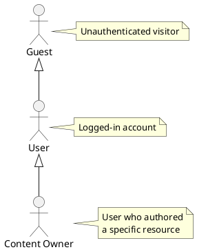
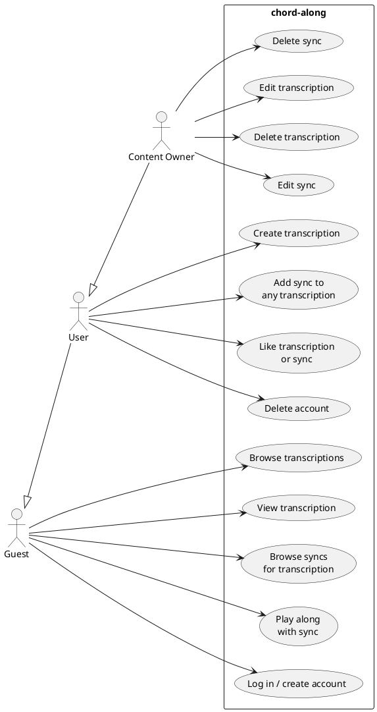
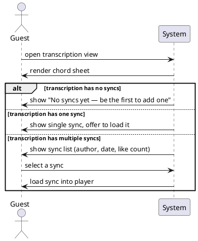

## ADDED Requirements

### Requirement: Actor roles

The system SHALL recognise three actor roles. Each role extends the capabilities
of the one before it.

- **Guest**: any visitor, authenticated or not. Can browse, view, and play.
- **User**: a logged-in account. Can additionally create content and rate.
- **Content Owner**: a User who is the `authorId` of a specific Transcription or
  Sync. Can additionally edit and delete that resource.

#### Scenario: Guest accesses without login

- **WHEN** an unauthenticated visitor navigates to any public page
- **THEN** the system SHALL serve it without requiring authentication

#### Scenario: Ownership is resource-scoped

- **WHEN** a User is the `authorId` of a Transcription
- **THEN** they SHALL have Content Owner capabilities for that Transcription only, not for other users' Transcriptions

### Requirement: Capability map

#### Scenario: Guest can play without login

- **WHEN** a Guest selects a sync on a transcription view page
- **THEN** the system SHALL load the player and begin playback without prompting for authentication

#### Scenario: User must be logged in to create content

- **WHEN** a Guest attempts to create a transcription or add a sync
- **THEN** the system SHALL redirect to the login flow before allowing the action

#### Scenario: User can add sync to any transcription

- **WHEN** a logged-in User submits a sync for a transcription authored by another User
- **THEN** the system SHALL accept the sync without checking transcription ownership

#### Scenario: Only the Content Owner can edit a transcription

- **WHEN** a User who is not the `authorId` attempts to edit a transcription
- **THEN** the system SHALL reject the request with a 403 Forbidden response

#### Scenario: Only the Content Owner can edit a sync

- **WHEN** a User who is not the `authorId` of a Sync attempts to edit it
- **THEN** the system SHALL reject the request with a 403 Forbidden response

### Requirement: Sync picker

When viewing a transcription that has multiple syncs, the system SHALL present a
sync picker so the user can choose which sync to load into the player.

#### Scenario: No syncs available

- **WHEN** a transcription has zero associated syncs
- **THEN** the transcription view SHALL display a prompt encouraging logged-in users to add one

#### Scenario: Multiple syncs shown with attribution

- **WHEN** a transcription has two or more syncs
- **THEN** the sync picker SHALL display each sync with its author's displayName, creation date, and like count

#### Scenario: Selecting a sync loads the player

- **WHEN** a user selects a sync from the sync picker
- **THEN** the player SHALL load the corresponding SyncPlayData and TranscriptionBundle and begin ready-to-play state
